# Dippy User Guide

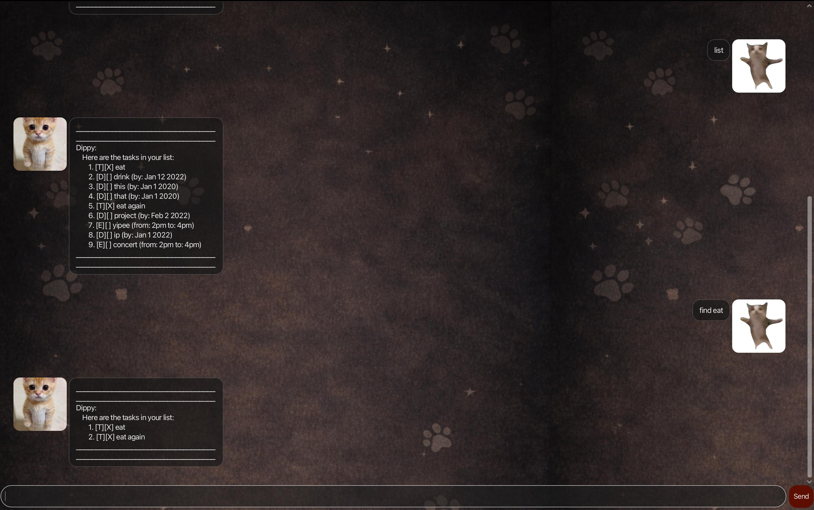

Dippy is a GUI desktop app for task management.
Dippy can record your tasks, help you find tasks, and sort your tasks.

## Listing Saved Tasks

Display the current list of tasks.

Example: list

Dippy will display the list of tasks

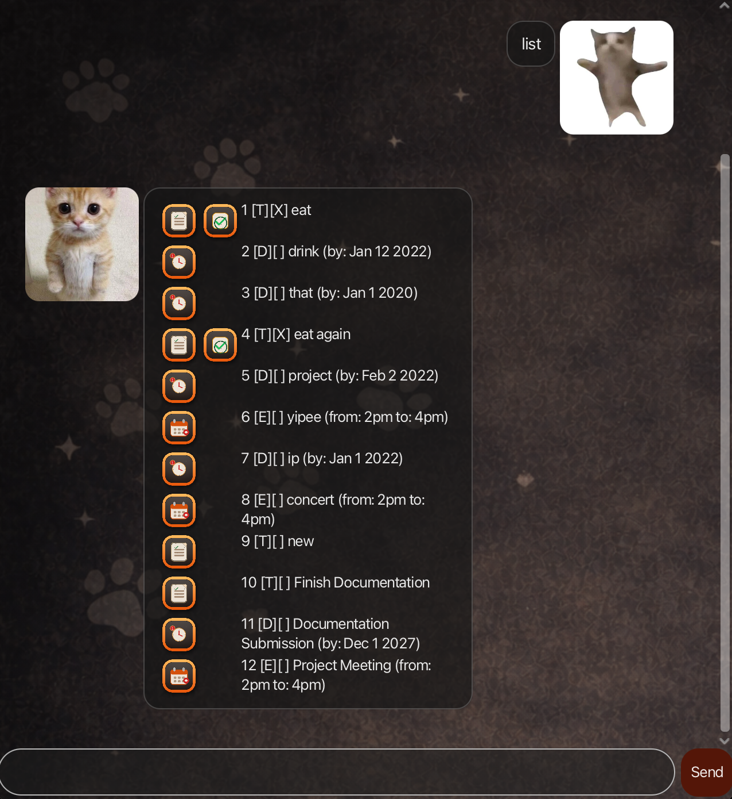

## Add Simple Task

Adds a task that only has a name to the task list

Example: todo [task description]

Dippy will display the task that you just entered and tells you the new
number of tasks that you have

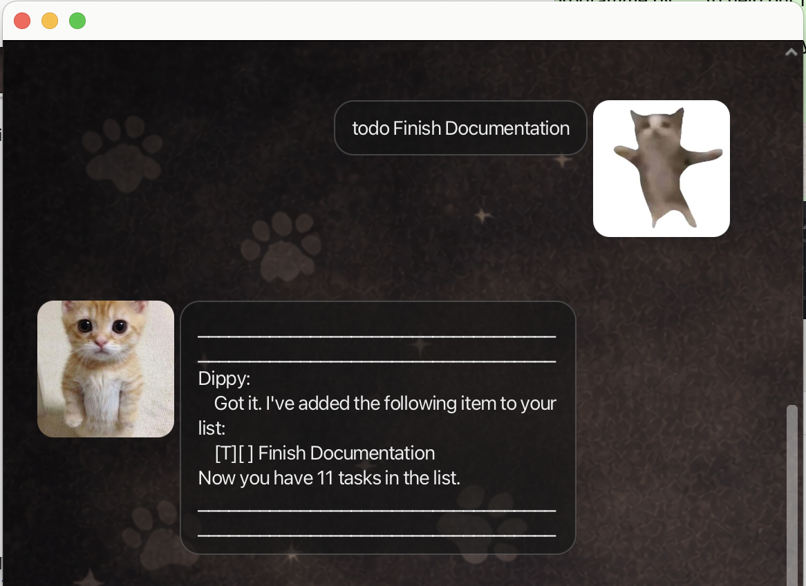

The task will also be displayed in the task list with a simple task icon

## Add Deadline Task

Adds a task that has a name and a deadline to the task list

Example: todo [task description] /by [YYYY-MM-DD]

Dippy will display the task that you just entered and tells you the new
number of tasks that you have

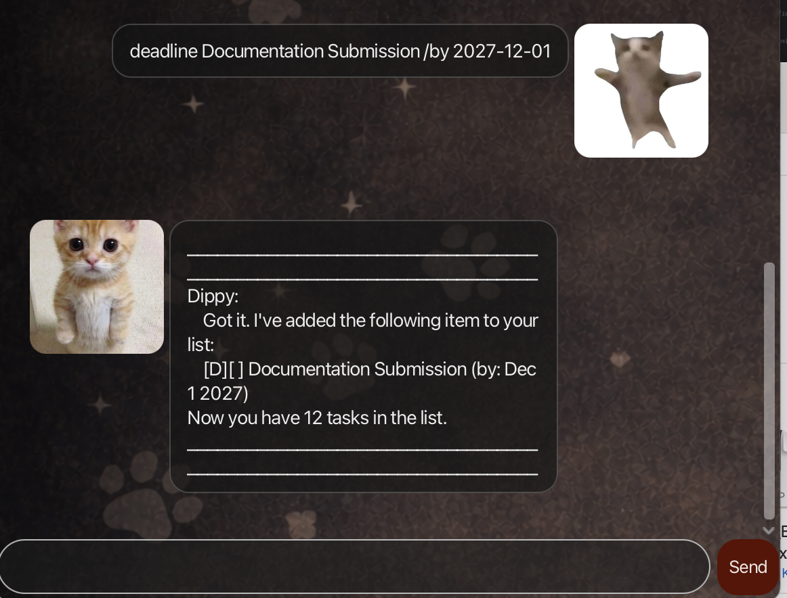

The task will also be displayed in the task list with a deadline icon

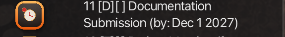

## Add Event Task 

Adds a task that has a name, start time, and end time to the task list

Example: event [event name] /from [start time] /to [end time]

Dippy will display the task that you just entered and tells you the new
number of tasks that you have

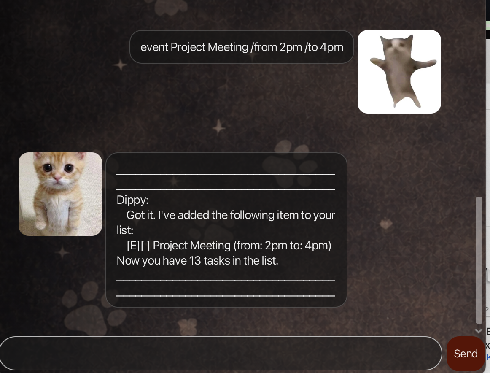

The task will also be displayed in the task list with an event icon

## Delete Task

Deletes the task based on the given task number in the task list

Example: delete [task number]

Dippy will display the task that you just deleted and tells you the new
number of tasks that you have

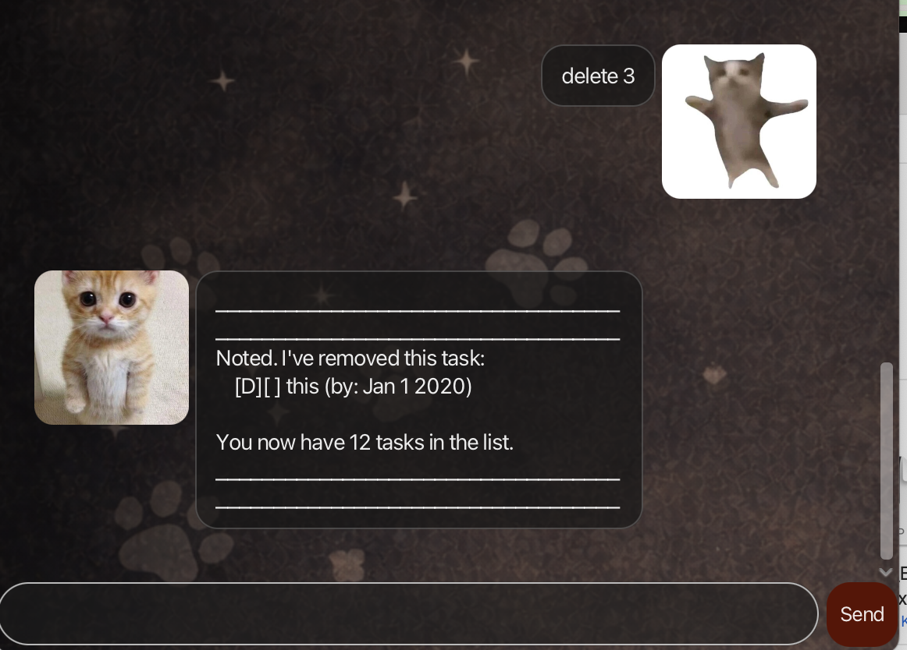

## Mark Task as Finished

Marks a task as finished using its task number in the task list

Example: mark [task number]

Dippy will display the task that you just marked and tells you that he
has marked the task as done. The task will now be displayed in the
task list with a checkmark

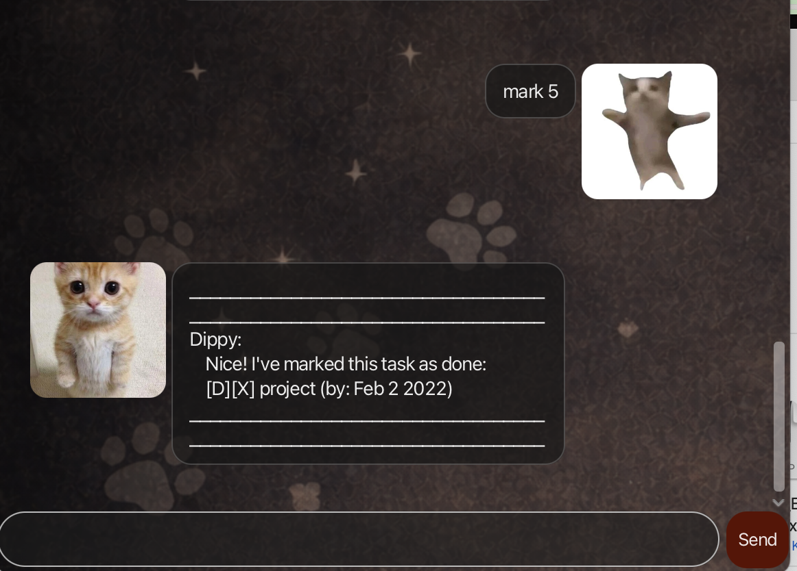

## Find tasks

Finds tasks containing a specified keyword

Example: find [keyword]

Dippy will display the tasks that contain the specified keyword

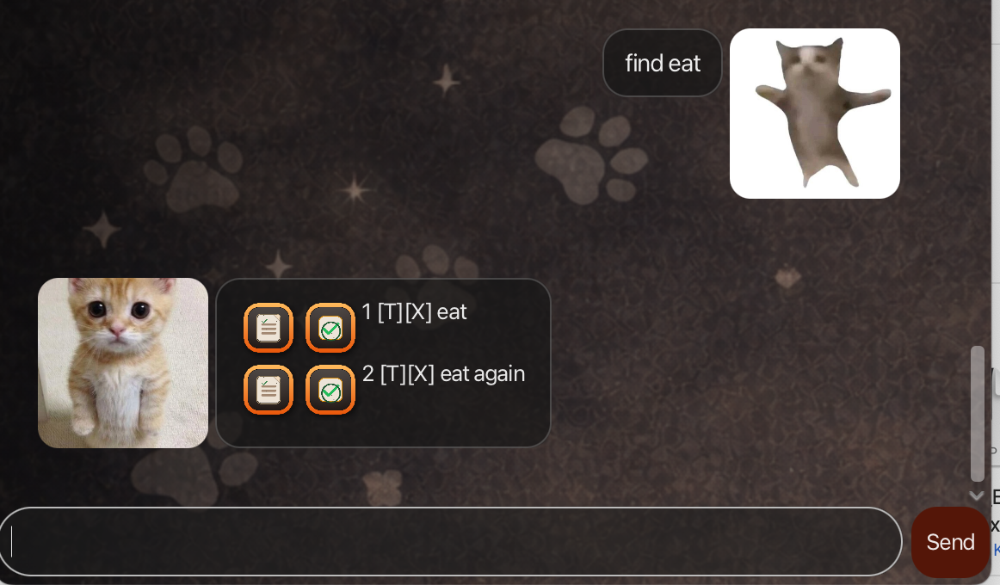

## Sort tasks

Sorts the tasks in the task list in alphabetical order to make task 
searching easier

Example: sort

Dippy will display the tasks in lexicographical ordering of their
names, ignoring case.

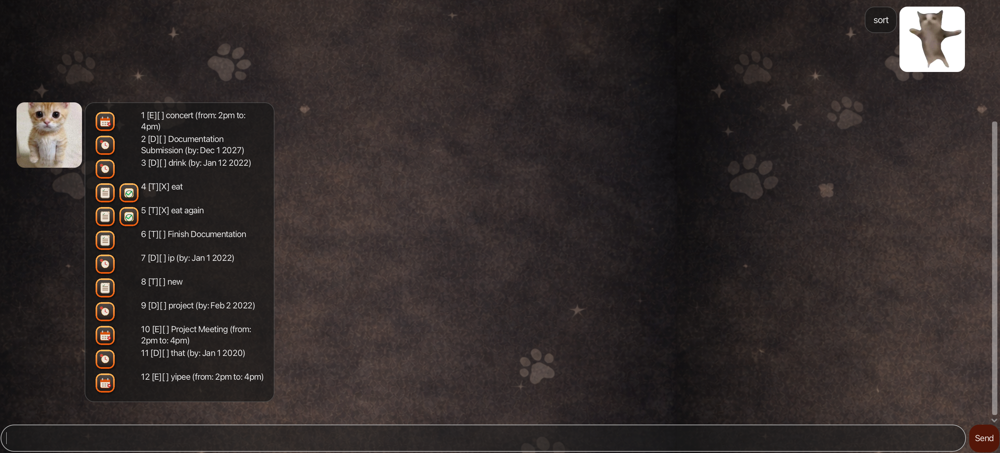

## Get help

Displays the list of instructions that Dippy can take from the user
as well as how to use them

Example: help

Dippy will display the list of commands that it can understand

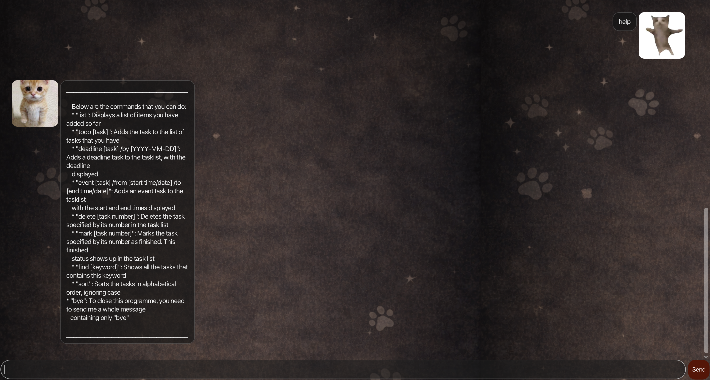